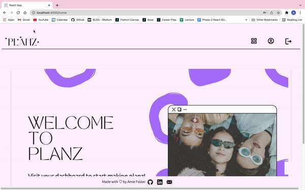

# PLANZ

Hello, 
Welcome to Planz! 

A centeralized hub for events! Use Planz to invite guests, make an itinerary, add accommodation information with directions, flight information for each guest, expense information for shared expenses and make packing lists so you dont forget a thing!

Wether your event is a single day party, or multi day vacation, keep track of it all with Planz!

## Demo



## Tech Stack

**Client:** React, Bootstrap

**Server:** Ruby on Rails, PostgresSQL, BCrypt

## Run Locally

Clone the project

```bash
  git clone https://github.com/amiefoster/bash
```

Go to the project directory

```bash
  cd bash
```

Install dependencies

```bash
  npm install @merc/react-timeline --prefix client
```
```bash
  bundle install
```
```bash
  rails db:migrate db:seed
```

Start the server

```bash
  rails s
```
```bash
  npm start --prefix client
```


## Contributing

Contributions are always welcome!

Feel free to open a pull request. 


## Authors

- [@amiefoster](https://github.com/amiefoster)


## 🔗 Links
[](https://medium.com/@amie.n.foster)
[](https://www.linkedin.com/in/amie-n-foster/)


